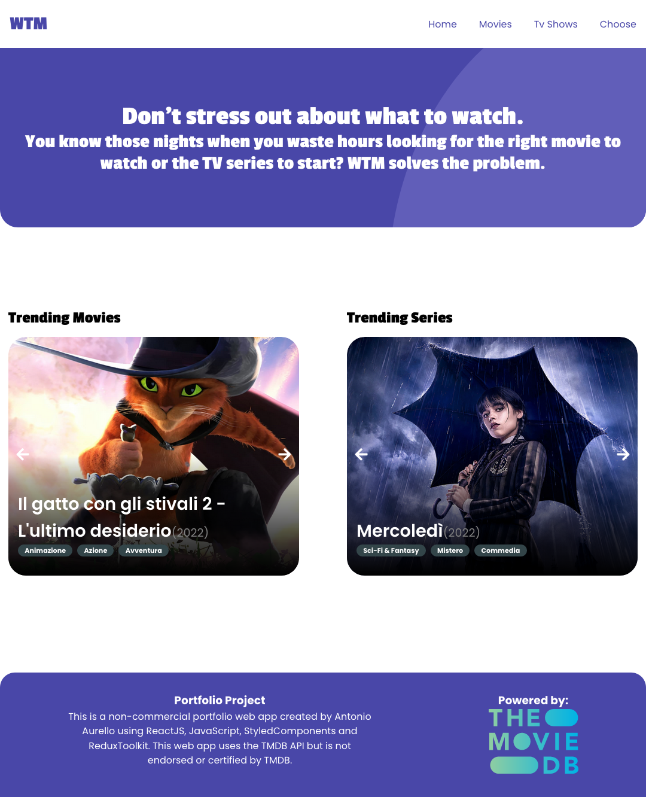
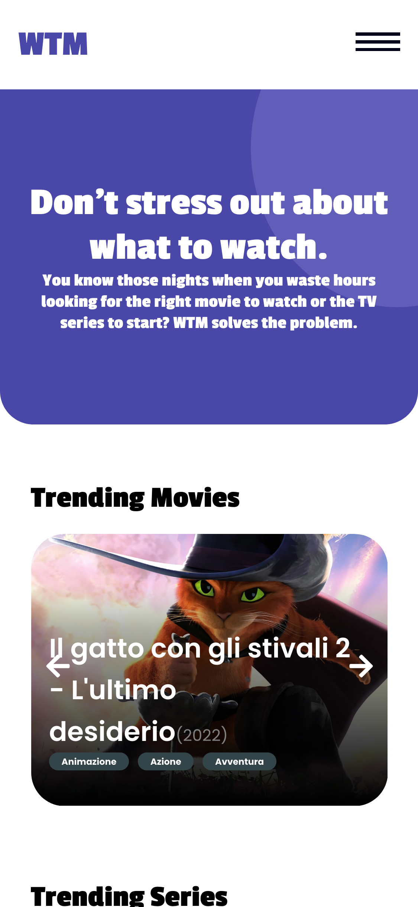

# WatchThatMovie Project

## Table of contents

- [Overview](#overview)
  - [The Project](#the-project)
  - [Screenshot](#screenshot)
  - [Links](#links)
- [My process](#my-process)
  - [Built with](#built-with)
  - [What I learned](#what-i-learned)
- [Author](#author)

## Overview

### The Project

This project came to my mind one evening when I was looking for something to watch on the streaming services with which I have a subscription, spending hours without being able to make up my mind. So I came up with Watch That Movie. No search, you can only view the trending movies or series at that moment and have the app select which movie to watch in a totally random way, by entering only the type (if movie or series), genre and streaming services.

Users should be able to:

- Scroll through the trending movies or series, depending on which country they're connecting from
- Randomly get a movie or series suggestion to watch depending on their streaming services
- View the optimal layout for the interface depending on their device's screen size
- See hover and focus states for all interactive elements on the page

### Screenshot

### Links

- Live Site URL: [Live Site](https://watch-that-movie.netlify.app)

## My process

### Built with

- [React](https://reactjs.org/) - JS library
- [Styled Components](https://styled-components.com/) - For styles
- [React-Router-Dom](https://reactrouter.com/en/6.4.3) - React framework
- [Redux Toolkit](https://redux-toolkit.js.org/) - Global State Management
- Styled-Components
- Flexbox
- Mobile-first workflow

### What I learned

It is always a pleasure to review all the topics studied during my learning path. In this project I wanted to brush up on my skills to optimally use React, Redux and createAsyncThunk, Styled Components, react-router-dom.

## Author

- GitHub - [Antonio](https://github.com/antonADev)
- LinkedIn - [Antonio Aurello](https://www.linkedin.com/in/antonio-aurello-894179211/)
- Twitter - [@AntonioAurello](https://www.twitter.com/AntonioAurello)
